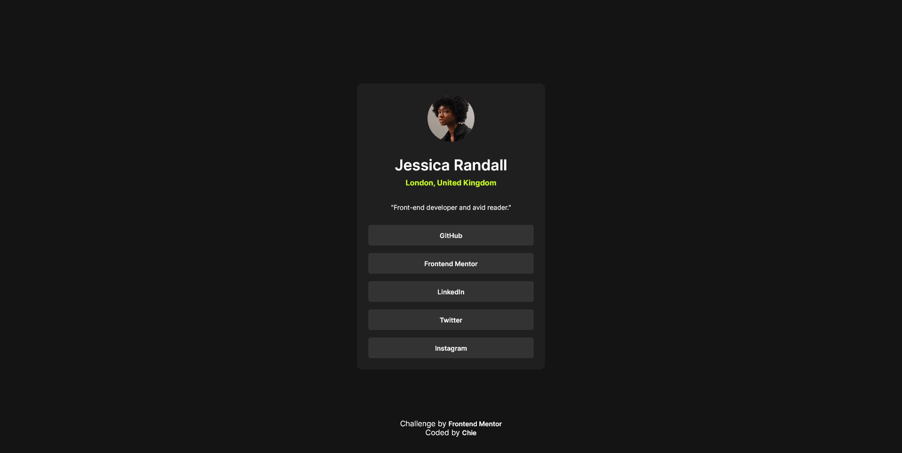
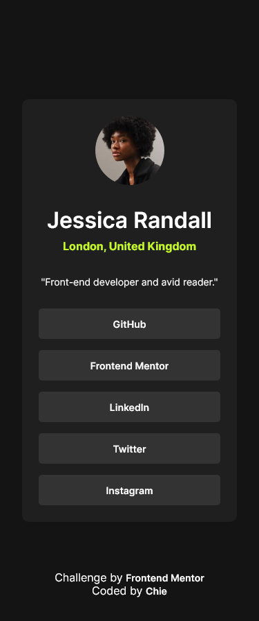

# Frontend Mentor - Social links profile solution

This is a solution to the [Social links profile challenge on Frontend Mentor](https://www.frontendmentor.io/challenges/social-links-profile-UG32l9m6dQ). Frontend Mentor challenges help you improve your coding skills by building realistic projects. 

## Table of contents

- [Overview](#overview)
  - [The challenge](#the-challenge)
  - [Screenshot](#screenshot)
  - [Links](#links)
  - [Built with](#built-with)
  - [What I learned](#what-i-learned)
- [Author](#author)

## Overview

### The challenge
Users should be able to:
- See hover and focus states for all interactive elements on the page

### Screenshot

### Links

- Solution URL: [FM-social-links Repo](https://github.com/cos-0000/fm-social-links)
- Live Site URL: [FM-social-links Site](https://cos-0000.github.io/fm-social-links/)

### Built with

- Semantic HTML5 markup
- CSS custom properties
- Flexbox
- Mobile-first workflow

### What I learned
- :focus state.

## Author

- Website - [cos-0000](https://github.com/cos-0000)
- Frontend Mentor - [cos-0000](https://www.frontendmentor.io/profile/cos-0000)

